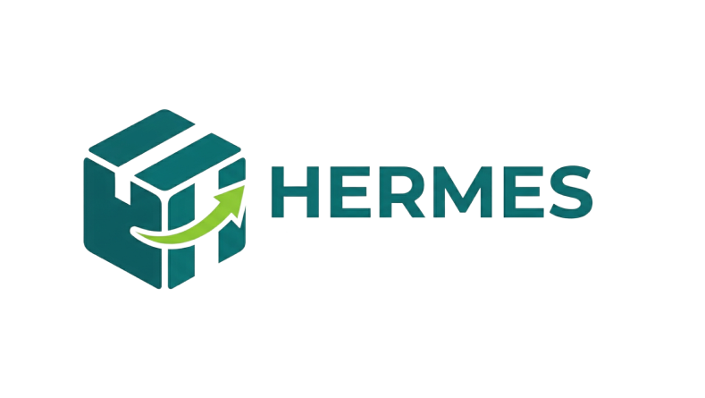

# FECAP - Fundação de Comércio Álvares Penteado

# Hermes 
# Marketplace B2B

## Hazel

## Integrantes: <a href="https://www.linkedin.com/in/%C3%A1lvaro-palazzin-053784271/">Álvaro Carvalho</a>, <a href="https://www.linkedin.com/in/dandaramonike/">Dandara Monike</a>, <a href="https://www.linkedin.com/in/leonardo-lamari-1b1464382/">Leonardo Lamari</a>, <a href="https://www.linkedin.com/in/luccas-covre/">Luccas Covre</a>

## Professores Orientadores: <a href="https://www.linkedin.com/in/eduardo-savino/">Eduardo Savino Gomes</a>, <a href="https://www.linkedin.com/in/ronaldo-araujo-pinto-3542811a/">Ronaldo Araujo Pinto</a>, <a href="https://www.linkedin.com/in/francisco-escobar/">Francisco Escobar</a>, <a href="https://www.linkedin.com/in/adriano-valente/">Adriano Valente</a>, <a href="https://www.linkedin.com/in/jbuesso/">José Carlos Buesso Junior</a>

## Descrição

   
  Desenvolvido por <a href="">Hazel</a> | 
  <a rel="license" href="https://creativecommons.org/licenses/by-sa/3.0/">CC BY-SA 3.0</a> | 
  <a href="http://pix4free.org/">Pix4free</a>

  
O <strong>Hermes é uma plataforma digital</strong> feita para facilitar a compra e venda de alimentos entre empresas (B2B). Ele funciona como uma ponte tecnológica que conecta produtores e distribuidores diretamente a restaurantes e mercados, de um jeito rápido, simples e muito seguro.
  
Nosso foco é conectar as pontas do mercado através de anúncios estratégicos, garantindo que compradores encontrem os melhores insumos e fornecedores alcancem novos parceiros de forma direta. <strong>Criamos um visual que equilibra a confiança de um negócio sério (no tom Teal) com o dinamismo de um mercado moderno e conectado (no Verde Lima)</strong>.
  

## 🛠 Estrutura de pastas

-Raiz 
| 
|-->documentos 
  &emsp;|-->antigos 
  &emsp;|Documentação.docx 
|-->executáveis 
  &emsp;|-->windows 
  &emsp;|-->android 
  &emsp;|-->HTML 
|-->imagens 
|-->src 
  &emsp;|-->Backend 
  &emsp;|-->Frontend 
|readme.md 

## 🛠 Instalação
(mais informações na segunda entrega)

## 💻 Configuração para Desenvolvimento
(mais informações na segunda entrega)

## 📋 Licença/License

   
  <strong>Hermes © 2026</strong>  
  Desenvolvido por: <a href="https://github.com/DandaraDandara">Dandara Monike</a>, <b>Álvaro Carvalho</b>, <b>Leonardo Lamari</b> e <b>Luccas Covre</b>

  
   
  <small>Este trabalho está licenciado sob uma <a rel="license" href="http://creativecommons.org/licenses/by-nd/4.0/">Licença CC BY-ND 4.0</a></small>

## 🎓 Referências

Aqui estão as referências usadas no projeto.

1. <https://github.com/iuricode/readme-template>
2. <https://github.com/gabrieldejesus/readme-model>
3. <https://chooser-beta.creativecommons.org/>
4. <https://freesound.org/>
5. <https://www.toptal.com/developers/gitignore>
6. Músicas por: <a href="https://freesound.org/people/DaveJf/sounds/616544/"> DaveJf </a> e <a href="https://freesound.org/people/DRFX/sounds/338986/"> DRFX </a> ambas com Licença CC 0.
